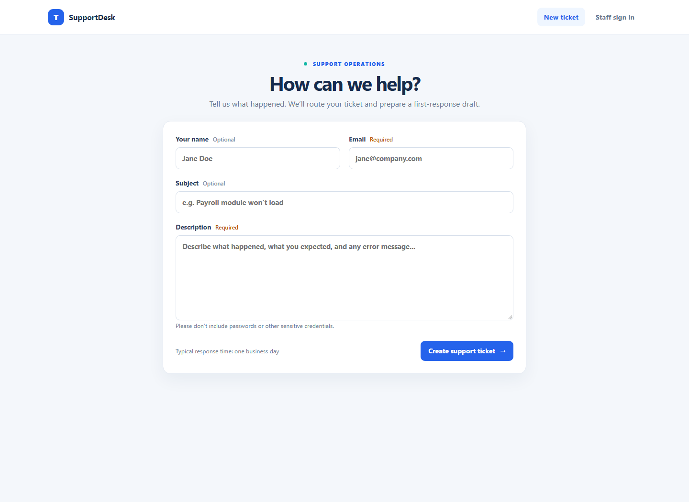

# SupportDesk — Support Ticket Triage

SupportDesk is a shared support workspace for one organization. Customers submit requests through a public form; authenticated support staff review, assign, update, and export the queue. It can run on a team server with persistent storage, instead of requiring every teammate to run a copy on their own computer.

## Screenshot



## What it does

- Classifies a request into one of five categories with a TF-IDF and Logistic Regression model.
- Suggests High, Medium, or Low priority using visible keyword rules.
- Lets staff sign in, review low-confidence suggestions, correct categories, assign requests, and track Open, In Progress, and Resolved work.
- Provides search, filters, pagination, category and status summaries, and filtered CSV export.
- Drafts a category-specific response for staff to review and personalize.
- Provides a staff ticket workspace with private investigation notes and a resolution summary before a new ticket can be marked Resolved.
- Includes an owner-curated troubleshooting library with category and keyword matching; related team guides appear on ticket workspaces.
- Lets the owner create expiring, single-use invitations for additional staff.
- Persists tickets and staff accounts in SQLite, with schema migration for existing ticket databases.
- Protects staff forms against CSRF, limits public submissions and sign-in attempts, and keeps staff-only data behind login.
- Provides a health endpoint at `/healthz` and a Docker Compose setup with persistent app data and Redis-backed rate limits.

## Run as a shared web app with Docker

Install Docker Desktop (or Docker Engine with the Compose plugin), then open PowerShell in the project folder.

1. Create a local environment file:

   ```powershell
   Copy-Item .env.example .env
   ```

2. Generate two different secrets:

   ```powershell
   python -c "import secrets; print(secrets.token_urlsafe(48))"
   ```

   Run that command twice. In `.env`, replace `ERP_TICKET_SECRET_KEY` with the first value and `ERP_SETUP_TOKEN` with the second. Keep `.env` private. For a local Docker run, keep `PUBLIC_BASE_URL=http://localhost:8000` and `ERP_COOKIE_SECURE=0`.

3. Start the app:

   ```powershell
   docker compose up --build -d
   ```

4. Open <http://localhost:8000/setup> and create the first owner account. The setup token is the value from `ERP_SETUP_TOKEN`. After the account is created, clear `ERP_SETUP_TOKEN` from `.env` and recreate the web container:

   ```powershell
   docker compose up -d --force-recreate web
   ```

   The setup page stays closed while an owner exists. If the database is ever replaced with an empty one, set a fresh setup token before allowing first-time setup again.

Customers can submit tickets at <http://localhost:8000/>. Staff use <http://localhost:8000/login>. The owner can open **Team** in the navigation to create seven-day invitation links. The owner shares each link with its intended teammate; this app does not send invitation emails.

Use **Guides** to add verified troubleshooting steps and matching keywords. Suggestions are links for staff to review; the classifier does not generate or execute fixes. Ticket notes and resolution summaries are visible only to signed-in staff.

Docker Compose stores the SQLite database in the named `supportdesk-data` volume and uses Redis for shared request-rate limits. Back up that volume regularly. The included Compose file runs one app instance, which is appropriate for a small team. Keep the volume when updating or recreating containers.

## Put it on the public internet

The project includes a production-style container, but it is not publicly hosted yet. To make it available outside your local network, deploy the container to a server or hosting provider that supports Docker Compose (or adapt the container to the provider), then configure all of the following:

- A domain name and HTTPS/TLS at the public edge.
- A persistent disk mounted at `/data`; otherwise SQLite records can be lost when the host replaces a container.
- A reachable Redis service and `RATELIMIT_STORAGE_URL` for rate limits shared by the app.
- `ERP_TICKET_SECRET_KEY` set to a unique random value of at least 32 characters.
- A temporary, unique `ERP_SETUP_TOKEN` while creating the first owner; clear it afterward.
- `PUBLIC_BASE_URL` set to the HTTPS origin, for example `https://support.example.com`.
- `ERP_COOKIE_SECURE=1` once the app is served only over HTTPS.
- `ERP_TRUSTED_PROXY_COUNT` set only to the exact number of trusted proxies in front of the app. Leave it at `0` when requests reach the app directly.
- A regular, tested backup of `/data` and a process for handling requester data according to your organization’s privacy and retention requirements.

Run a single app instance with SQLite. For multiple app instances or heavier concurrent use, migrate the database layer to PostgreSQL before scaling out. Do not expose the dashboard or API without authentication. The ticket API remains disabled unless `ERP_TICKET_API_TOKEN` is configured.

## Local Python development

Use Python 3.10 through 3.12 with the pinned dependencies. The app binds only to `127.0.0.1` in this mode.

```powershell
python -m venv .venv
.\.venv\Scripts\Activate.ps1
pip install -r requirements.txt
python model\train_model.py
python app.py
```

Open <http://127.0.0.1:5000>. The first visit to **Staff sign in** redirects to owner setup. The SQLite database is `tickets.db` in the project folder. To use the API, set `ERP_TICKET_API_TOKEN` in the environment and send `Authorization: Bearer <token>` to `GET /api/tickets`.

## Model quality and human review

The included training examples are synthetic. The latest template-separated evaluation reached **35% accuracy on 40 held-out examples**. The displayed score is not calibrated, and the model should be treated as a weak routing suggestion. Staff should review predictions, especially low-confidence ones. Do not claim production-grade classification accuracy from this demo dataset.

The trainer can include anonymized records with a valid `reviewed_category`:

```powershell
python model\train_model.py --feedback-csv path\to\anonymized-tickets.csv
```

Feedback rows are added to training in memory and are not copied to the bundled dataset. The model artifact is regenerated locally. Keep personal and confidential information out of training exports unless your organization has approved that use.

## Data and email behavior

Ticket submissions are public and require a valid contact email, but the app does not verify ownership of that email. Tickets are stored on the server, and staff can view and export requester details. The app does not send email notifications or replies; staff review the queue and follow up through their normal support channel. Do not enter passwords, payment data, or other secrets in ticket descriptions.

## Project structure

```text
app.py                   Flask routes, authentication, knowledge library, database, and API
responder.py             Template-based response generator
model/train_model.py     Synthetic data generation and optional feedback training
data/sample_tickets.csv  Synthetic demonstration data
templates/               Public form, staff login, setup, ticket workspace, guides, and queue pages
static/style.css         Responsive styling
Dockerfile               Non-root production container
compose.yaml             App, persistent data volume, Redis, and health check
requirements.txt         Python dependencies
```
